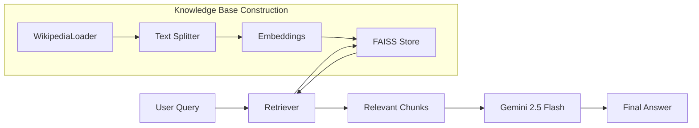
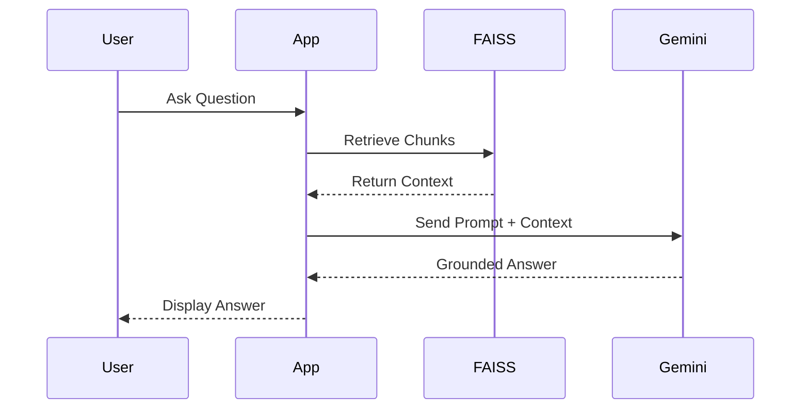
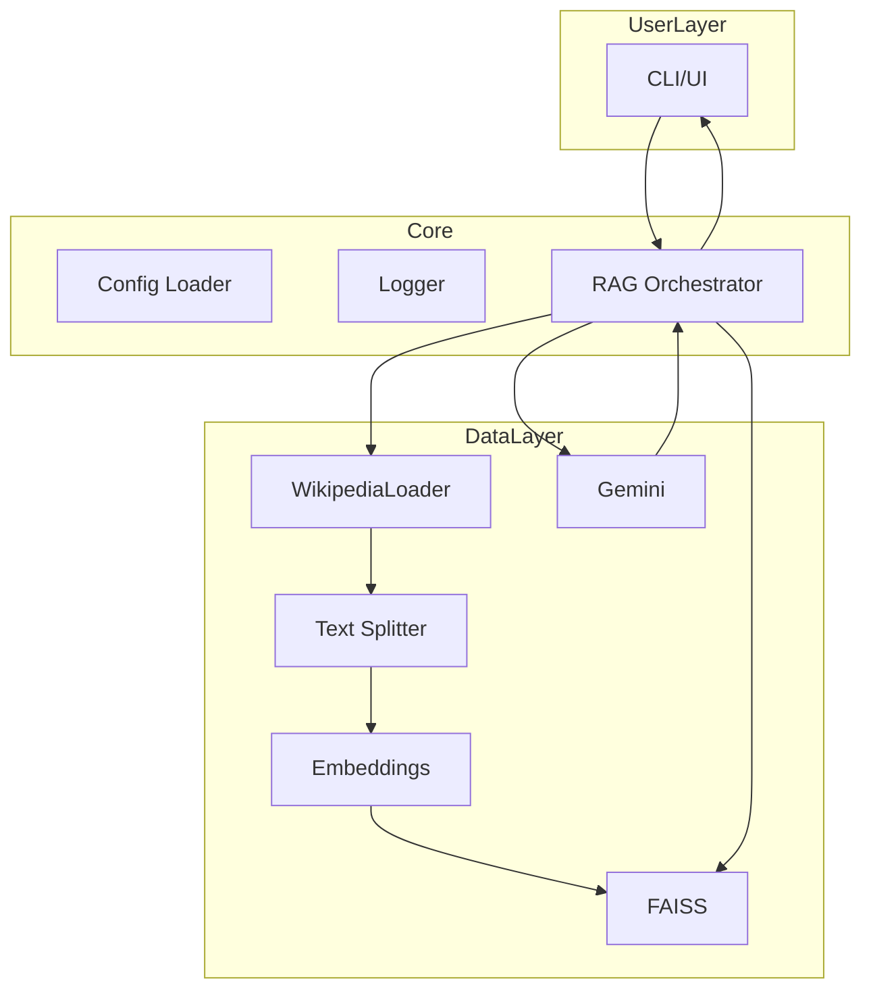

# 1. 🧠 RAG Wiki Assistant: A Zero‑Hallucination Framework for Fact‑Grounded Question Answering
### Retrieval‑Augmented Generation with LangChain, FAISS & Gemini 2.5 Flash

---

## 2. 🧾 Abstract
Large Language Models (LLMs) often hallucinate—confidently producing false information. **RAG Wiki Assistant** solves this by grounding every response in retrieved, verifiable Wikipedia context using a Retrieval‑Augmented Generation pipeline.

This publication now includes:
- Full renumbered format for clarity
- Expanded maintenance/support documentation
- Comprehensive visual architecture diagrams
- Model selection rationale
- New explanatory sections for usability and comprehension

---

## 3. 🔍 Problem Statement
LLMs hallucinate, which is dangerous in **education**, **research**, **policy**, and **knowledge systems**. This project tackles that problem directly: **no retrieved context → no answer**.

---

## 4. 🎯 Purpose
The RAG Wiki Assistant provides:
- Accurate, fact‑grounded responses
- Transparent, explainable reasoning
- Verifiable citations from retrieved documents
- Multi‑turn reliability without hallucination

### 4.1 What This Publication Adds
- Architecture visuals
- Model rationale
- Expanded maintenance
- Production‑ready documentation

### 4.2 Use Cases
- Educational Q&A
- Research support
- Corporate knowledge bases
- Fact‑checking workflows
- Explainable AI systems

---

## 5. 💡 Value & Impact
### 🔑 Advantages
- 100% citation‑grounded responses
- Eliminates hallucinations
- Dynamic topic adaptation
- Verifiable, repeatable outputs
- Session‑aware retrieval and generation

---

## 6. 🧩 Technical Quality
### 6.1 Core Tech Stack
| Component | Purpose |
|----------|---------|
| LangChain | Retrieval orchestration |
| FAISS | Fast vector search |
| Gemini 2.5 Flash | Grounded answer generation |
| HuggingFace Embeddings | Vectorization |
| WikipediaLoader | Content ingestion |
| Logging + dotenv | Configuration & debugging |

### 6.2 Model Rationale
**HuggingFace MiniLM Embeddings**
- Fast, lightweight, high semantic quality
- Ideal for CPU inference

**FAISS Vector Store**
- Industry standard for dense vector search
- Excellent speed & scalability

**Gemini 2.5 Flash**
- Strong reasoning
- Reliable grounded generation
- Handles long contextual prompts

---

## 7. 📐 Visual Architecture Diagrams

### 7.1 Flowchart


### 7.2 Sequence Diagram


### 7.3 Component Diagram


---

## 8. ⚙️ Installation & Usage
### 8.1 Setup
```bash
git clone https://github.com/Ramee4sure/RAG-Wikipedia-Assitant.git
cd RAG-Wikipedia-Assitant
python -m venv .venv
source .venv/bin/activate
pip install -r requirements.txt
python src/app.py
```

### 8.2 Environment Settings
```
WIKI_TOPIC="Machine Learning"
CHUNK_SIZE=500
```

---

## 9. 🧰 Technical Implementation
### 9.1 Startup Code
```python
from rag_chain.rag import start_bot
if __name__ == "__main__":
    start_bot()
```

### 9.2 Pipeline
1. Load Wikipedia
2. Chunk text
3. Embed chunks
4. Store vectors in FAISS
5. Retrieve relevant context
6. Generate grounded responses

---

## 10. 🧠 Prompt Engineering
Gemini receives **context-only prompts**, enforcing hard grounding.

---

## 11. 📊 Example Interaction
**Q:** What is Transfer Learning?

**A:** Transfer learning is a technique ... *(verified from Wikipedia)*

**Out of Scope:** "I cannot answer using the provided documents."

---

## 12. 🧪 Testing & Quality
- Manual validation
- Logging for debugging
- Future: unit tests, RAG evaluation scores

---

## 13. 🛠️ Maintenance & Support
### 13.1 Maintenance Strategy
- Weekly reliability checks
- Continuous dependency updates
- Automatic FAISS index rebuilds for new content
- Stability testing before version releases

### 13.2 Support Channels
- GitHub Issues
- Email support
- Community discussions

### 13.3 Long‑Term Sustainability
- Open‑source governance model
- Contributor guidelines
- Version tagging + changelogs

### 13.4 SLA‑Style Commitments
For academic/enterprise adopters:
- 48‑hour response for critical bugs
- Regular model performance reviews
- Compatibility support for new Gemini versions

---

## 14. 🗂️ Project Structure
```bash
RAG-Wikipedia-Assistant/
├── src/
│   ├── scraper/
│   ├── rag_chain/
│   └── app.py
├── wikipedia_pages/
├── vectorstore/
├── .env_example
└── requirements.txt
```

---

## 15. 🪪 License
MIT License

---

## 16. 📬 Contact
**Author:** Manas Gaurkar  
📧 manas.gaurkar.dev@gmail.com  
🌐 GitHub: Ramee4sure

---

## 17. 📜 Changelog & Version History
### 17.1 Version 1.0.0 — Initial Release
- Core RAG pipeline implemented
- Wikipedia ingestion module added
- FAISS vector store initialized
- Gemini-based response generation integrated
- Logging + .env configuration system added
- Visual architecture diagrams introduced

### 17.2 Planned 1.1.0 Enhancements
- Multilingual retrieval support
- Streamlit UI prototype
- Automated RAG evaluation benchmarks
- Token-efficient context compression

---

## 18. 🧾 MIT License — Extended Explanation
The **MIT License** is one of the most permissive open-source licenses available. By choosing MIT, this project ensures:

### 18.1 Your Rights Under MIT
- ✔ You can **use** the software commercially or privately
- ✔ You can **modify** the source code
- ✔ You can **distribute** copies
- ✔ You can **relicense** your modifications
- ✔ You have full freedom for research, production, and commercial deployment

### 18.2 Your Obligations Under MIT
The only requirement is:
- You **must include the original copyright notice**
- You **must include the MIT License text** in any copy or reuse

### 18.3 Why MIT Was Chosen
- Encourages innovation and external contributions
- Preferred by academic and enterprise environments
- Simple, human-readable, legally safe

---

### 🧠 "Retrieval before Generation — because truth matters."

